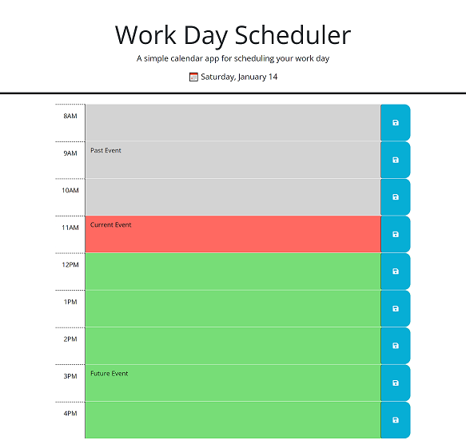

# Challenge 5: Work Day Scheduler

## ✏️ Description 

With this project, I wanted to create a work day scheduler that would help me organize and schedule out my (or another user's) personal work day  better. My normal hours are 8am-4pm, so I set those hours, and added the color coding. Past hours appear as gray, the current hour shows as red, and upcoming hours show as green. As soon as it hits the hour, it should update (with a refresh of the page!). Each text block has a save button next to to save anything that the user inputs. This info persists until through refresh, and can be removed by erasing the data and saving, or opening the console and clearing local storage, and refreshing the page.

## User Story

* AS AN employee with a busy schedule
* I WANT to add important events to a daily planner
* SO THAT I can manage my time effectively

## Acceptance Criteria

* GIVEN I am using a daily planner to create a schedule
* WHEN I open the planner
* THEN the current day is displayed at the top of the calendar
* WHEN I scroll down
* THEN I am presented with time blocks for standar business hours
* WHEN I view the time blocks for that day
* THEN each time block is color-coded to indicate whether it is in the past, present, or future
* WHEN I click into a time block
* THEN I can enter an event
* WHEN I click the save button for that time block
* THEN the text for that event is saved to local storage
* WHEN I refresh the page
* THEN the saved events persist

## 🖥️ Technologies Used

* JavaScript/HTML/CSS
* jQuery
* Day.js

## ⚙️ Installation

N/A

## 🌐 Deployed Application

The deployed application can be found at this link:
https://jsheen98.github.io/coding-bootcamp-challenge-work-day-scheduler/

## 📸 Assets

The following images represent the website's appearance:

## 📜 License

Please refer to the LICENSE in the repo